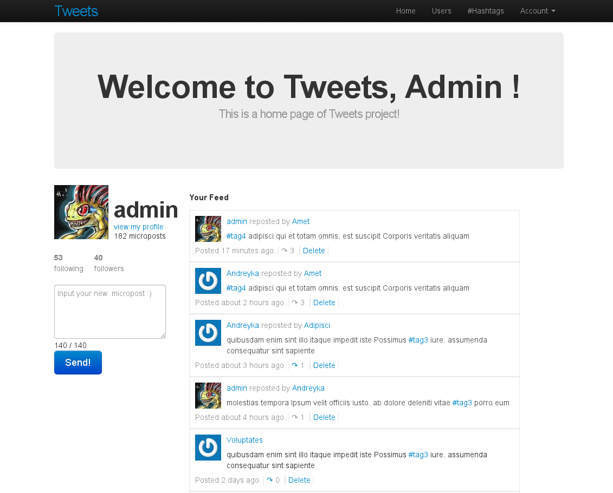
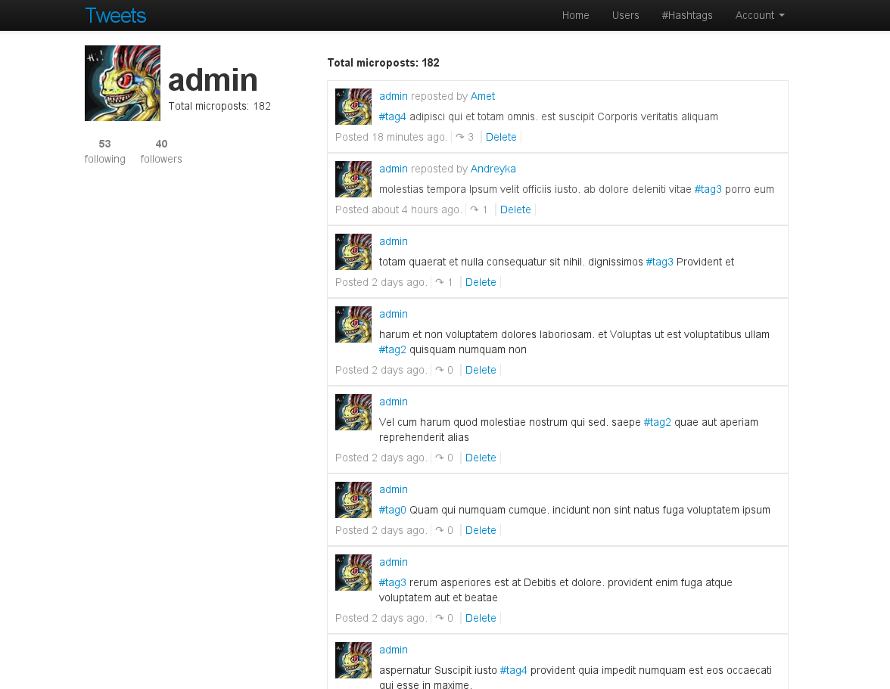
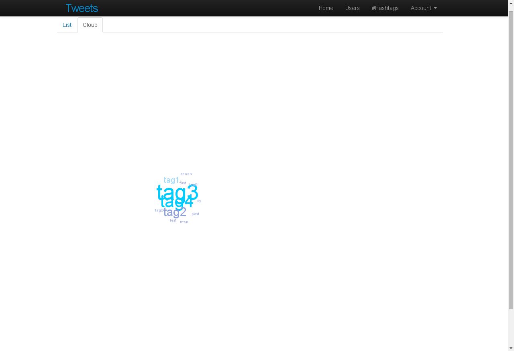

======================================
Tweets
======================================
Andrey Nagorny

www: [anagorny.com](anagorny.com)
 
======================================
VERSION 1.0
======================================
*Demo:* [tweets.anagorny.com](tweets.anagorny.com)

*Homepage:*

*Profile page:*

*Tags cloud:*

**Implemented:**
- Users with Gravatar;
- Microposts;
- Hashtags for microposts;
- Users feed;
- E-mail verification;

======================================

This is my first web app on Ruby on Rails. It has nothing to do with real-world projects that are used in production: it I just learn Rails. 

Thank http://www.railstutorial.org/book.
