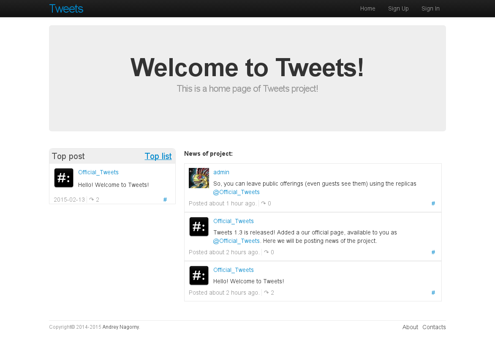

======================================
Tweets
======================================
Andrey Nagorny

www: [anagorny.com](http://anagorny.com)
 
======================================
VERSION 1.3
======================================
*Demo:* [tweets.anagorny.com](http://tweets.anagorny.com)

*Homepage for guest:*

*Homepage for user:*

*Profile page:*

*Tags cloud:*

**Implemented in 1.3:**
- Rating for Miroposts (on how many repost);
- Update Home page view;
- Upgrade application to rails 4.2

**Implemented in 1.2:**
- E-mail verification;
- Reset user password;
- Repost-action for microposts;

**Implemented in 1.0:**
- Users with Gravatar;
- Microposts;
- Hashtags for microposts;
- Users feed;

======================================
**In the repository configuration files are missing:**

- /config/database.yml
- /config/secrets.yml
- /config/initializers/setup_mail.rb
- /db/seeds.rb

======================================

This is my first web app on Ruby on Rails. It has nothing to do with real-world projects that are used in production: it I just learn Rails. 

Thank http://www.railstutorial.org/book.
